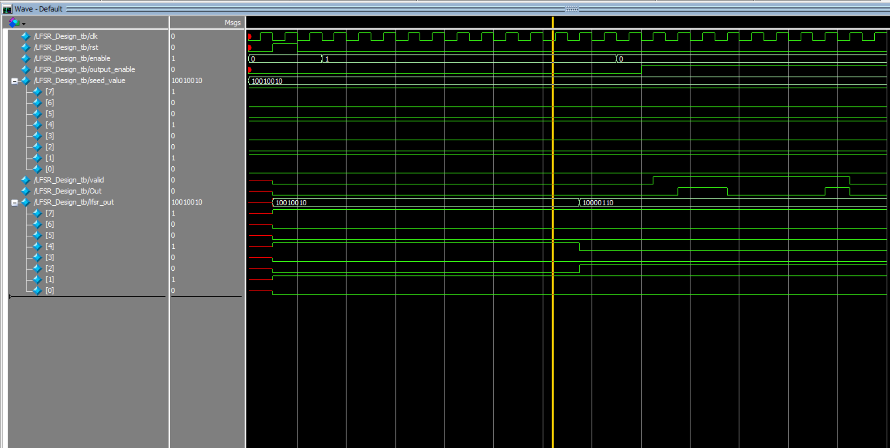
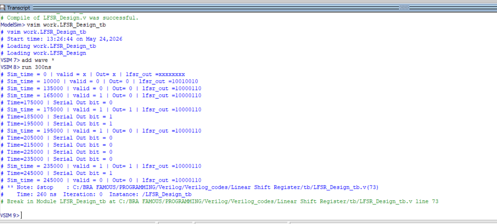

# Design and Verification of an 8-Bit Linear Feedback Shift Register in Verilog HDL


## Abstract

This project presents the design and functional verification of an 8-bit Linear Feedback Shift Register (LFSR) implemented in Verilog HDL. The design uses XOR feedback taps to generate a pseudo-random sequence from a programmable seed, stores the generated result, and serializes the final value with a valid signal.

Verification was performed using a directed Verilog testbench in ModelSim. The simulation confirms seed loading, feedback-based shifting, final LFSR value storage, and LSB-first serial output behavior.

## 1. Introduction

A Linear Feedback Shift Register is a sequential circuit whose next input bit is generated by applying XOR logic to selected register bits known as taps. LFSRs are commonly used in pseudo-random sequence generation, Built-In Self-Test (BIST), communication systems, cryptography, error detection, and hardware verification.

The objective of this project was to build a clean FPGA/ASIC-style RTL implementation of an LFSR and verify its behavior through simulation, waveform inspection, and transcript-based output checking.

## 2. Project Structure

```text
Linear Shift Register/
|-- rtl/
|   `-- LFSR_Design.v
|
|-- tb/
|   `-- LFSR_Design_tb.v
|
|-- Task/
|   |-- Full_LFSR_Project_Transcript.txt
|   |-- Seeds_b.txt
|   |-- Expec_Out_b.txt
|   `-- Screenshot 2026-05-23 124625.png
|
|-- results/
|   |-- wave_result.png
|   `-- transcript.png
|
|-- LFSR.mpf
|-- LFSR.cr.mti
`-- README.md
```

## 3. RTL Design Specification

The top-level module is `LFSR_Design`. It implements an 8-bit right-shifting LFSR with a separate output register for serial transmission.

| Parameter | Default | Description |
|---|---:|---|
| `width_in` | 8 | Seed and internal LFSR width |
| `width_out` | 8 | Stored output width |
| `countwidth` | 4 | Generation and output counter width |

### Top-Level Interface

| Signal | Direction | Width | Description |
|---|---:|---:|---|
| `clk` | Input | 1 | Clock signal |
| `rst` | Input | 1 | Active-high asynchronous reset |
| `enable` | Input | 1 | Enables LFSR generation |
| `output_enable` | Input | 1 | Enables serial output after generation |
| `seed_value` | Input | 8 | Initial LFSR seed loaded on reset |
| `valid` | Output | 1 | Indicates that `Out` contains a valid serial bit |
| `Out` | Output | 1 | Serial LFSR output bit |
| `lfsr_out` | Output | 8 | Debug output showing the generated LFSR state |

## 4. LFSR Architecture

The design is organized into the following functional blocks:

- LFSR state register
- XOR feedback network
- 10-cycle generation counter
- Output storage register
- Serial output shifter
- Output valid control logic

The feedback equation is:

```verilog
feedback = lfsr_reg[7] ^ lfsr_reg[5] ^ lfsr_reg[4] ^ lfsr_reg[3];
```

This corresponds to the polynomial:

```text
x^8 + x^6 + x^5 + x^4 + 1
```

During generation, the feedback bit is inserted at the MSB and the register shifts right:

```verilog
lfsr_reg <= {feedback, lfsr_reg[7:1]};
```

After 10 generation cycles, the final LFSR state is copied into `out_reg` and exposed through `lfsr_out`. The stored result is then serialized LSB-first when `output_enable` is asserted.

## 5. Verification Methodology

Functional verification was performed using `tb/LFSR_Design_tb.v`. The testbench includes:

- DUT instantiation
- 10 ns clock generation
- Reset sequencing
- Directed seed stimulus
- Generation enable control
- Serial output enable control
- `$monitor`-based signal tracing
- `$display` messages for valid serial output bits

The directed simulation uses:

| Item | Value |
|---|---|
| Clock period | 10 ns |
| Seed value | `10010010` |
| Generation duration | 10 LFSR shifts |
| Serial output order | LSB first |

Task reference vectors are included in `Task/Seeds_b.txt` and `Task/Expec_Out_b.txt` for future file-based verification expansion.

## 6. Running the Simulation

From the project root:

```tcl
vlib work
vlog rtl/LFSR_Design.v
vlog tb/LFSR_Design_tb.v
vsim work.LFSR_Design_tb
add wave *
run 300ns
```

Command-line simulation:

```tcl
vsim -c work.LFSR_Design_tb -do "run 300ns; quit -f"
```

## 7. Simulation Results

The ModelSim simulation shows that the seed is loaded during reset, the LFSR completes its generation phase, and the final stored value is shifted out serially when `output_enable` is asserted.

Observed directed-test result:

| Signal / Result | Value |
|---|---|
| Seed | `10010010` |
| Final `lfsr_out` | `10000110` |
| Serial output | `0 1 1 0 0 0 0 1` |
| Output order | LSB first |

The serial output sequence matches the LSB-first serialization of `10000110`.





## 8. Concepts Demonstrated

- Sequential RTL design
- Linear feedback shift register architecture
- XOR feedback tap selection
- Parameterized Verilog modules
- Active-high reset behavior
- Counter-controlled operation
- LSB-first serial data transmission
- Testbench development
- ModelSim waveform and transcript analysis

## 9. Future Improvements

- Add file-based verification using `Seeds_b.txt` and `Expec_Out_b.txt`.
- Convert the testbench into a self-checking PASS/FAIL environment.
- Support configurable tap masks for different LFSR polynomials.
- Add a selectable generation-cycle count.
- Add SystemVerilog assertions for control sequencing.
- Generate VCD output for GTKWave-based review.

## 10. Conclusion

This project completed the RTL design and simulation of an 8-bit Linear Feedback Shift Register in Verilog HDL. The design successfully demonstrates seed loading, feedback-based state generation, final-state storage, and valid-controlled serial output. The waveform and transcript results confirm the expected operation for the directed testbench scenario.
